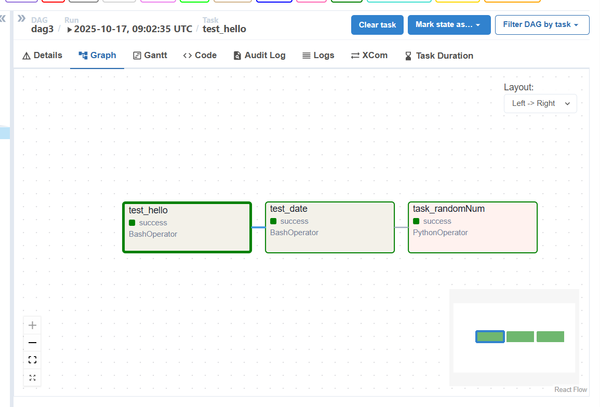
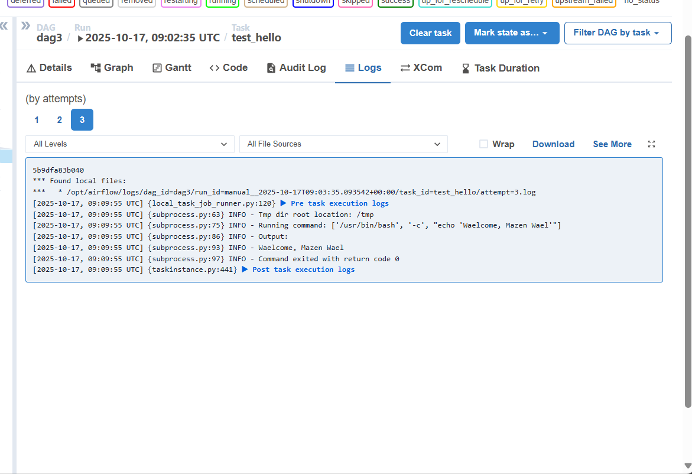
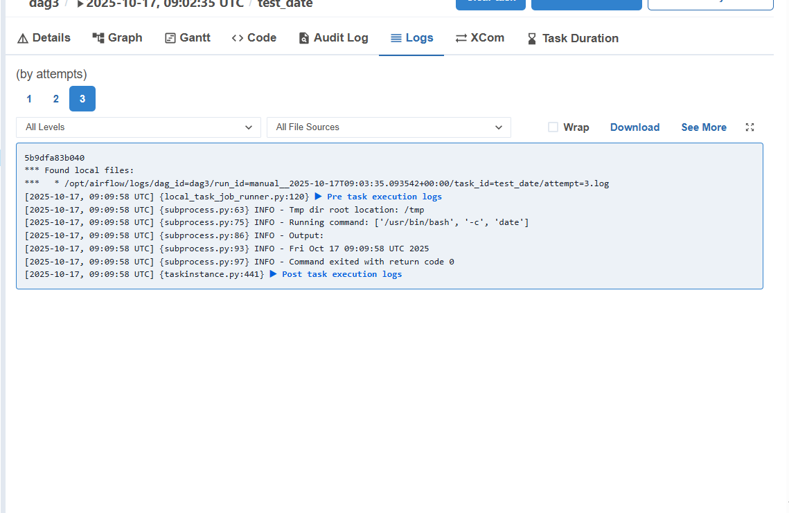
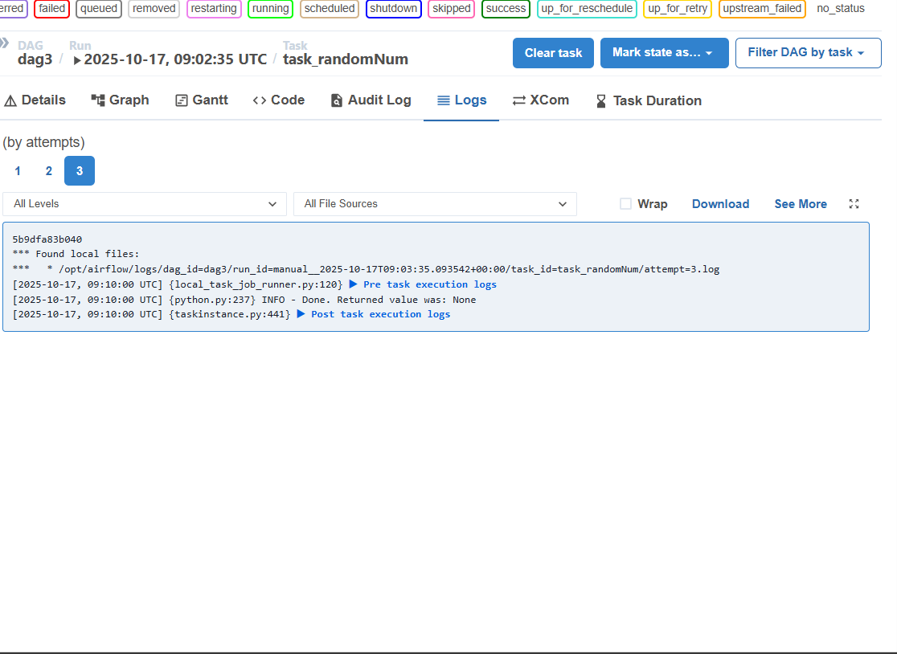

# 🌀 Airflow_Depi Project

## 📘 Project Overview
This project defines an **Apache Airflow DAG** named `Airflow_Depi` that demonstrates basic task orchestration using both **BashOperator** and **PythonOperator**.  
The DAG contains three sequential tasks that:
1. Print the current date  
2. Display a welcome message  
3. Generate random numbers and save them to a text file  

---

## 🧩 DAG Structure

| Task ID | Operator | Description |
|----------|-----------|-------------|
| `print_date` | BashOperator | Prints the current system date |
| `welcome_message` | PythonOperator | Prints a custom welcome message |
| `generate_random` | PythonOperator | Generates 10 random integers (1–99) and saves them to `/tmp/random.txt` |

---

## ▶️ How to Run

1. **Start Airflow**
   ```bash
   airflow standalone
   ```
2. Open the web UI → [http://localhost:8080](http://localhost:8080)
3. Enable and trigger the DAG `Airflow_Depi`
4. Wait for all tasks to succeed ✅

---

## 📸 Screenshots

| Description | Screenshot |
|--------------|-------------|
| DAG Graph View |  |
| Logs - Task 1 |  |
| Logs - Task 2 |  |
| Logs - Task 3 |  |


---

## 📝 Notes
- This project shows how to combine **BashOperator** and **PythonOperator** in one DAG.  
- Random numbers are saved in `/tmp/random.txt`.  
- Logs confirm each step's success.  

---
